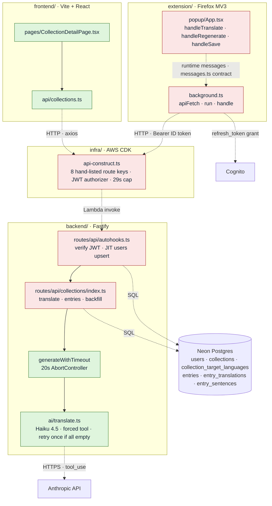

# Research: the capture → translate → save flow

**Date**: 2026-08-20
**Researcher**: KStrzechowski
**Git Commit**: `98ddef9` (`docs(map): repo map and its three source artifacts`)
**Branch**: `docs/repo-map` (not pushed — no GitHub permalinks, local paths only)
**Repository**: InkLingo

## Research Question

Analyse the capture → translate → save flow in its **current state**, with
particular attention to the related areas `context/map/repo-map.md` records.
Three sub-questions: (1) the end-to-end trace from entry point through the
layers to persistence and back; (2) which methods and branches on that path
are covered by tests and which are not; (3) the blast radius — what must
change together — combining the static import graph with git co-change.

The flow crosses all four apps: extension popup → background → backend route →
Anthropic → Neon, and is read back by the frontend. Three of those hops carry
**no import edge**, so `repo-map.md` records them as `[unknown]`. They are
carried forward here as real couplings, not as absence of coupling.

Description only. No proposals, no redesign.

## Summary

The flow works, and it is the most carefully-reasoned code in the repo — the
popup alone carries four separate stale-result guards written in response to
bugs that already happened. What it does **not** have is any mechanism that
checks the seams it is built out of.

Five findings dominate:

1. **The contract is the type, and the type is copied three times.** The
   backend declares no response schemas at all. `TranslationResult`
   (`backend/src/ai/translate.ts:37-40`) *is* the public API shape — the route
   returns the AI layer's object verbatim (`collections/index.ts:249`) — and it
   is re-declared by hand in `extension/src/types.ts:33-36` and, for the read
   path, in `frontend/src/api/collections.ts:3-37`. Nothing anywhere compares
   the three.
2. **`extension/src/background.ts` — the entire HTTP client for this flow —
   has zero test coverage, and its quality gate passes vacuously.** No test
   file imports it. Verified empirically: `vitest related src/background.ts
   --run` prints *"No test files found, exiting with code 0"*. This is exactly
   the failure mode `context/foundation/lessons.md` names in "A quality gate
   that can silently not run is worse than no gate", in a second location.
3. **The model's output is never validated, only re-shaped.**
   `translate.ts:148` casts `toolUse.input as TranslationResult` with no
   runtime check. `alignToRequested` (`translate.ts:113-120`) guarantees the
   *language list* is well-formed; nothing guarantees anything inside it.
4. **The retry only fires when every language is empty.**
   `isEmpty` (`translate.ts:122-124`) is `.every(...)`. A response where four
   of five languages are populated and one is empty is returned as-is, renders
   as "Nothing came back for this language", and is counted client-side as a
   `DegradedAiResult` report (`App.tsx:236-243`) — the only place in the system
   that can see it, because the request was a 200 that parsed fine.
5. **The two paths through this flow that call a paid API are the only two
   rate-limited routes in the repo, and the limiter is per-Lambda-instance.**
   Documented and accepted in
   `context/archive/2026-07-25-capture-translate-save/change.md`; the real
   backstop is the Anthropic Console spend limit, not code.

---

# 1. Feature overview

## What it is

S-03 `capture-translate-save`, the roadmap's *gwiazda przewodnia* (guiding
star) and a literal restatement of the PRD's Primary success criterion. Built
2026-07-25 → 2026-08-02 over five phases, archived at
`context/archive/2026-07-25-capture-translate-save/`. It implements US-01 and
FR-006, FR-007, FR-009, FR-010, FR-011, FR-012, FR-013, FR-015 and FR-018.

The user types a word or phrase into the Firefox extension popup and receives —
for **every** target language the active collection teaches, in one action —
several translation variants, each with an IPA transcription and its own
candidate example sentences paired with a native-language gloss; picks one
variant and one sentence per language; and saves the result as an entry in the
collection. The saved entry is then read by the separate web app.

## Preconditions

A collection is required first, and it carries the language configuration:
`native_language_code` on `collections`, plus 1–5 rows in
`collection_target_languages` (`MAX_TARGET_LANGUAGES = 5`,
`backend/src/routes/api/collections/schemas.ts:6`). Created via
`POST /api/collections` (`collections/index.ts:100-153`), which validates codes
against `SUPPORTED_LANGUAGE_CODES` — eight ISO 639-1 codes,
`backend/src/languages.ts:4` — and rejects duplicates and a native code that
also appears as a target (`index.ts:121-126`).

**A collection's languages are immutable after creation.** No edit path exists
and none is planned (plan.md *What We're NOT Doing*). This is load-bearing for
several things below.

## The four user actions

| Action | Surface | Endpoint | Notes |
| --- | --- | --- | --- |
| **Capture / translate** | popup, `App.tsx:215-254` | `POST /api/collections/:id/translate` (`index.ts:218-250`) | One Anthropic call for **all** target languages. Persists nothing. |
| **Regenerate sentences** (FR-012) | popup, `App.tsx:258-340` | same endpoint, same body | Client-side only. Re-asks for everything, keeps just this language's fresh sentences. |
| **Save** (FR-013) | popup, `App.tsx:358-410` | `POST /api/collections/:id/entries` (`index.ts:252-353`) | One non-interactive transaction across three tables. |
| **Backfill one language** (FR-018) | **web app**, `CollectionDetailPage.tsx:102-128` | `POST /api/collections/:id/entries/:entryId/translations` (`index.ts:358-436`) | Same AI seam, single language, no user pick. |

Note the split: three of the four live in the extension, the fourth lives in
the frontend. The extension has no backfill button; the web app has no capture.

## The AI contract

`backend/src/ai/translate.ts`, the only file in `backend/src/ai/`:

- Model `claude-haiku-4-5-20251001` (`:3`), forced through a single tool
  `return_translation` via `tool_choice: { type: 'tool' }` (`:138`) — never
  free-form prose.
- `max_tokens = 2048 × max(targetLanguageCodes.length, 1)` (`:10`, `:132`).
  Scaled per language because five languages in one response overran the old
  flat 1536 and truncated the `tool_use` JSON mid-object.
- The tool's `input_schema` (`:52-106`) is the nested shape:
  `normalizedNativeText` + `languages[] → variants[] → sentences[]`, with
  `phoneticTranscription: string | null` and `minItems: 1` on both arrays.
- `alignToRequested` (`:113-120`) rebuilds the language array against what was
  *requested*, so a language the model reordered or skipped comes back with
  `variants: []` rather than vanishing.
- `EMPTY_RESULT_RETRIES = 1` (`:19`): one retry when **every** language comes
  back empty. Added after a measured ~3-in-34 failure rate against the live
  API.

Wrapped by `generateWithTimeout` (`collections/index.ts:50-66`) — a 20s
`AbortController` (`TRANSLATE_TIMEOUT_MS`, `:21`), any throw collapsed to
`null` and logged with the request's correlation id, `null` → `badGateway`.
**Shared by both AI routes**, which is why it is the natural interception seam
(recorded as such in `context/changes/translation-cache/research.md`).

## Persistence

Three tables, one non-interactive `fastify.sql.transaction` (`index.ts:311-329`):

- `entries` — id generated app-side with `randomUUID()` because the Neon HTTP
  driver cannot feed a `RETURNING` value into the next statement
  (`:306-309`). `source_language_code` is **always** the collection's native
  code, never the request body (`:313-314`).
- `entry_translations` — one row per picked language; `UNIQUE(entry_id, language_code)`.
- `entry_sentences` — one row per picked language.

Schema across `backend/migrations/1784584360698_create-core-schema.ts`,
`1785419841325_add-collection-languages.ts`,
`1785433311673_add-entry-phonetics-and-sentence-gloss.ts`.

## Read-back

`GET /api/collections/:id` (`index.ts:155-216`) assembles collection +
target languages + entries + translations + sentences into one JSON body.
`frontend/src/pages/CollectionDetailPage.tsx:65-97` fetches it on mount behind
a `cancelled` flag, renders each entry with a `SpeakButton` per row, and
computes `missing` — the collection's target codes absent from that entry's
translations, compared case-insensitively — into the "Add ⟨lang⟩" buttons at
`:234-243`.

## The design decisions that shape all of it

Settled during implementation and recorded in
`context/archive/2026-07-25-capture-translate-save/change.md`:

- **One Anthropic call for all languages, not one per language.** Chosen for
  cost (~$0.008 vs ~$0.04 at five languages). Consequence: the response is
  all-or-nothing — a failure blanks the whole capture. Per-language failure
  isolation is impossible by construction, which is why acceptance criterion
  5.5 had to be rewritten at verification time.
- **Ephemeral until save.** The translate route persists nothing.
- **Sentences nest under variants, not under the word.** A sentence
  demonstrating "bank" as a riverbank is irrelevant to the financial "bank".
  This is an inference from FR-009 + FR-010 read together, flagged as such in
  the plan.
- **Regeneration pairs variants by meaning text, never by index**
  (`sameMeaning`, `App.tsx:35-37`), because generation is non-deterministic.
- **Generation tokens everywhere.** `generationRef` (`App.tsx:112`) is bumped
  by every new call *and* by anything that invalidates one — collection
  switch, logout (`abandonInFlight`, `:152-156`). Only the call that still owns
  its generation clears the busy flag. This is `lessons.md`'s "A value read
  before an `await` must not be written back after it", written into the code
  after four such bugs were found in one change.
- **Measured, not estimated** (live API, 5 languages, 10 captures): **$0.0063
  per capture**, 4.7–10.0s latency against the 20s route timeout, peak 1,721
  output tokens against 10,240 budgeted.

---

# 2. End-to-end trace

Evidence tags: **[import]** static edge · **[runtime]** `browser.runtime`
messaging · **[http]** network · **[sql]** database · **[aws]** deploy-time
infra. Everything not `[import]` is invisible to every check in this repo.

## Capture leg

| # | File:line | What happens | Crosses | Tag |
| --- | --- | --- | --- | --- |
| 1 | `extension/src/popup/App.tsx:454` → `:215` | form submit → `handleTranslate`; `generationRef` bumped, generation captured | — | — |
| 2 | `extension/src/messages.ts:69-75` | `sendMessage({ type: 'translate', collectionId, text })` | popup doc → background script | **[runtime]** |
| 3 | `extension/src/background.ts:176` → `:154` → `:123` | `onMessage` listener → `handle` → `run`, case `'translate'` (`:135-139`) | — | — |
| 4 | `extension/src/auth.ts` (`getIdToken`) | reads `browser.storage.local`; refresh-token grant to Cognito if near expiry; `null` → throws *"Your session expired"* (`background.ts:57-59`) | ext → Cognito | **[http]** |
| 5 | `extension/src/background.ts:75-79` | `fetch(API_BASE_URL + path, { method: 'POST', Authorization: Bearer, body: { text } })`. `API_BASE_URL` is a build-time `VITE_*` string (`config.ts:4`) | ext → backend | **[http]** |
| 6 | `infra/lib/constructs/api-construct.ts:181-186` | API Gateway route key `POST /api/collections/{id}/translate`, JWT authorizer, 29s Lambda cap (`:75`), stage throttle 5 rps / burst 10 | edge | **[aws]** |
| 7 | `backend/src/app.ts:30-45` | `@fastify/autoload` with `autoHooks: true, cascadeHooks: true` | — | [import] |
| 8 | `backend/src/routes/api/autohooks.ts:11-42` | verifies Bearer ID token; JIT-upserts the `users` row; sets `request.authUser` | → Neon | **[sql]** |
| 9 | `backend/src/plugins/error-handler.ts:44-46` | stamps `request.correlationId` | — | [import] |
| 10 | `backend/src/routes/api/collections/index.ts:218-224` | body validated against `translateBodySchema` (`schemas.ts:29-31` — only `text`); per-route rate limit 20/min keyed on `authUser.id` (`:69-75`) | — | [import] |
| 11 | `.../ownership.ts:19-26` (`fetchOwnedCollection`) | `SELECT ... FROM collections WHERE id = $1 AND user_id = $2`; `undefined` → 404 | → Neon | **[sql]** |
| 12 | `.../index.ts:29-35`, `:234-236` | target languages fetched and **lower-cased** | → Neon | **[sql]** |
| 13 | `.../index.ts:50-66`, `:240-245` | `generateWithTimeout`: 20s `AbortController` | — | [import] |
| 14 | `backend/src/ai/translate.ts:130-139` | `client.messages.create` — Haiku 4.5, forced tool, scaled `max_tokens`, `signal` passed through | backend → Anthropic | **[http]** |
| 15 | `translate.ts:141-153` | finds the `tool_use` block (missing → throws `:145`); `toolUse.input as TranslationResult` (`:148`); `alignToRequested` | — | [import] |
| 16 | `translate.ts:155-164` | retry once if **all** languages empty | → Anthropic | **[http]** |
| 17 | `.../index.ts:246-249` | `null` → `reply.badGateway`; otherwise the AI object is returned **verbatim** — no response schema, no mapping | — | — |
| 18 | `error-handler.ts:50-52` | `x-request-id: <correlationId>` on every response | — | [import] |
| 19 | `background.ts:96-121` | `!response.ok` → `report()` + throw (429 → *"Too many requests…"*, `:16-18`); ok → `void flush(sendReports)`, then `response.json()` | backend → ext | **[http]** |
| 20 | `background.ts:154-156` → `messages.ts:69-75` | `{ ok, data }` envelope unwrapped | background → popup | **[runtime]** |
| 21 | `App.tsx:227-245` | stale-generation check; empty-language count → `reportFromPopup({ name: 'DegradedAiResult' })`; `setCapture` + `initialSelections` | — | — |

## Save leg

| # | File:line | What happens | Tag |
| --- | --- | --- | --- |
| 22 | `App.tsx:202-213` | `selectVariant` (drops the sentence pick — sentences belong to a variant), `selectSentence` | — |
| 23 | `App.tsx:344-357` | `pickable` = languages with variants; `readyToSave` requires a complete pick for **every** pickable language | — |
| 24 | `App.tsx:358-386` | `sendMessage({ type: 'save-entry', ... })` with `wordOrPhrase: capture.wordOrPhrase` (the *normalized* form) | **[runtime]** → **[http]** |
| 25 | `.../index.ts:252-291` | `createEntryBodySchema`; trim + lowercase; blank-after-trim guard (`:273-278`); duplicate-language guard (`:281-286`); ownership → 404 | **[sql]** |
| 26 | `.../index.ts:296-304` | every `languageCode` must be one of the collection's targets — compared case-insensitively *because rows predating normalization still hold codes like `'EN'`* (comment `:294-296`) | **[sql]** |
| 27 | `.../index.ts:310-329` | one `sql.transaction`: `entries` + N × `entry_translations` + N × `entry_sentences` | **[sql]** |
| 28 | `.../index.ts:334-352` | 201 with the assembled entry | — |
| 29 | `App.tsx:390-399` | `setSaved(...)` shown even under a stale generation (it names the collection the entry actually landed in); `rememberCollection` / reset only if the generation still holds | — |

## Read-back and backfill

| # | File:line | What happens | Tag |
| --- | --- | --- | --- |
| 30 | `frontend/src/pages/CollectionDetailPage.tsx:65-97` | `getCollection(id)` on mount, `cancelled` guard, 404 distinguished from other errors | **[http]** |
| 31 | `.../index.ts:155-216` | four SELECTs assembled into one body | **[sql]** |
| 32 | `CollectionDetailPage.tsx:187-193` | `missing` computed case-insensitively → "Add ⟨lang⟩" buttons (`:234-243`) | — |
| 33 | `frontend/src/api/collections.ts:62-77` | `addEntryTranslation`, `timeout: AI_REQUEST_TIMEOUT_MS` (25s, `client.ts:41`), deliberately **not** `replaySafe` | **[http]** |
| 34 | `.../index.ts:358-436` | same rate limit, ownership ×2, target-language check, 409 if already present, `generateWithTimeout` with a single-element language array, takes `variants[0].sentences[0]` (no user picks here, `:396-397`), two INSERTs in one transaction | **[sql]** |

## Diagram



Solid arrows are import edges a tool can verify. **Every dashed arrow is
`[unknown]`** in `repo-map.md`'s sense — no import edge, so no rule, metric or
check sees it. Red nodes participate only in couplings nothing can check.

---

# 3. Test coverage and gaps

## Which runner covers what

| Runner | App | Config | Runs where |
| --- | --- | --- | --- |
| `node:test` + `--experimental-test-coverage` | backend | `backend/package.json`, `test/tsconfig.json`, glob `test/**/*.ts` | **CI only** (ephemeral Neon branch) |
| Vitest | frontend | `frontend/vite.config.ts`, `test/**/*.test.{ts,tsx}` | per-edit, pre-commit, pre-push, CI |
| Vitest | extension | `extension/vite.config.ts`, `test/**/*.test.{ts,tsx}` | per-edit, pre-commit, pre-push, CI |
| Playwright (`playwright.config.ts`) | frontend | `browser-tests/*.spec.ts` | print geometry only |
| Playwright (`playwright.e2e.config.ts`) | frontend | `e2e/*.spec.ts` — backend stubbed at `page.route` | seed / print route / reauth prompt |

**No E2E test covers this flow.** `context/foundation/test-plan.md:131` records
that as a decision, not an oversight: a full journey would need a live backend
and would assert against stubbed responses the test itself invented, and the
extension is out of Playwright's reach entirely.

**Backend runs in CI only.** `scripts/quality/checks.mjs:52` sets backend and
infra to `lint: false, riskAreas: []`, and `heavyChecksFor` (`:141-159`) skips
backend at pre-push too — deliberately, because `tsc` is ~20s and the suite
needs a live Neon branch (`checks.mjs:25-32`). So the majority of this flow's
logic is never exercised by any local gate.

**No coverage thresholds exist** in any of the three apps. `c8` sits unused in
`backend/package.json` devDependencies; neither Vitest config has a
`test.coverage` block.

## Per-unit coverage

| Unit | File:line | Status | Covered by |
| --- | --- | --- | --- |
| `POST /:id/translate` | `index.ts:218-250` | partial | `backend/test/routes/api/translate.test.ts` (7 cases), `collections-rate-limit.test.ts:26` |
| `POST /:id/entries` | `index.ts:252-353` | partial | `entries.test.ts` (10 cases, incl. transaction rollback at `:243-264`) |
| `POST /:id/entries/:entryId/translations` | `index.ts:358-436` | partial | `entry-translations.test.ts` (6 cases) |
| `generateWithTimeout` | `index.ts:50-66` | partial — **abort branch never reached** | success/failure stubs only |
| `generateTranslation` / retry loop | `translate.ts:155-164` | covered for `EMPTY_RESULT_RETRIES = 1` | `translate.test.ts:115,151,180` |
| `alignToRequested` | `translate.ts:113-120` | covered | `translate.test.ts:80` "reorders and backfills" |
| `requestTranslation` call params | `translate.ts:126-139` | **not covered** | stub ignores arguments entirely |
| missing `tool_use` throw | `translate.ts:144-146` | **not covered** | every stub returns a well-formed block |
| `fetchOwnedCollection` / `fetchOwnedEntry` | `ownership.ts:19-38` | covered + statically enforced | 404 tests per route; `route-ownership.test.ts:59` |
| `extension/src/background.ts` — **all of it** | `:15-176` | **not covered at all** | — |
| `messages.ts` `sendMessage` / `reportFromPopup` | `:53-75` | covered via a fake | `observability/popupReporting.test.ts`, `helpers/webext.ts:53-68` |
| `popup/App.tsx` handlers + race guards | `:215-410` | **best-covered code on the flow** | `extension/test/popup/App.test.tsx`, incl. 6 in-flight race cases at `:358-561` |
| `frontend/src/api/collections.ts` `getCollection` / `createCollection` | `:44-58` | **not covered as real code** — module mocked | page tests mock the whole module |
| `addEntryTranslation` | `collections.ts:62-77` | covered (real impl) | `frontend/test/api/client.test.ts` asserts the 25s timeout |
| `CollectionDetailPage` load / gap detection / backfill | `:65-128` | covered | `CollectionDetailPage.test.tsx` (13 cases) |

## Branch gaps worth naming

- **The 20s timeout has never fired under test.** `grep` for
  `abort|AbortSignal|signal` across `backend/test/` returns nothing. Every stub
  in `backend/test/helpers/anthropic.ts:8-39` resolves or rejects immediately.
  The 502 is reached through a thrown-error stub, never through a real abort.
- **Blank-after-trim on save** (`index.ts:273-278`): the schema's `minLength: 1`
  blocks `""` but not `"   "`, so this is live code — untested.
- **The rate-limit 429 is tested for `/translate` only.** The backfill route
  carries the same `config: translateRateLimit` (`index.ts:363`) and has no
  429 test.
- **The language-mismatch guard is tested via the `translations` array only**
  (`entries.test.ts:147`); a `sentences`-only mismatch is not separately
  asserted.
- **The frontend's 404 branch** (`CollectionDetailPage.tsx:83`) is exercised
  with a plain `Error`, never with a real `AxiosError` carrying
  `response.status === 404`.

## Structural blind spots

1. **The Anthropic client is stubbed everywhere.** `helpers/anthropic.ts`
   replaces `app.anthropicClient` wholesale and **never inspects the arguments
   it is called with**. The model id, the `max_tokens` formula, the system
   prompt and `tool_choice` are asserted nowhere. This is `lessons.md`'s
   "A stubbed AI client cannot tell you the model's output is usable" — the
   lesson exists *because* 65 green tests coexisted with a ~9% live failure
   rate.
2. **The extension↔backend HTTP hop has no coverage of any kind.** The popup
   suite fakes `browser.runtime.sendMessage` (`test/helpers/webext.ts:53-68`),
   so the popup↔background envelope is checked but `background.ts`'s URL
   construction, headers, JSON body and error mapping are not.
3. **The gate on `background.ts` passes vacuously — verified.**
   `checks.mjs:47` routes the whole of `extension/src/` into `vitest related`.
   Running it directly:

   ```
   $ ./node_modules/.bin/vitest related src/background.ts --run
   No test files found, exiting with code 0
   ```

   Editing the flow's HTTP client produces a green check that ran no
   assertions, at the per-edit and pre-commit layers both.
4. **`route-reachability.test.ts` compares source text, not behaviour.** It
   recognises only the literal `fastify.<method>('/path', …)` and
   `addRoutes({ path, methods })` shapes (comment `:29-37`); a route declared
   via `fastify.route({ method, url })` would be invisible to both extractors
   and report as *matching*. `lessons.md` says the same thing in its own update
   note.
5. **`route-ownership.test.ts:59-84` greps for the call, not the check.** It
   proves `fetchOwnedCollection(` appears in each `:id` handler's source slice;
   it cannot tell whether the `undefined` return is acted on.
6. **`infra/` has no real tests** — its only test file is the unmodified CDK
   scaffold stub. No migration harness exists either; schema correctness is
   only implied by the integration tests.

---

# 4. Blast radius

Static graph from `context/map/artifact-2-dependencies.md` + `fanout.txt`
(dependency-cruiser 16.10.4, 185 modules / 389 deps, `.dependency-cruiser.cjs`,
2026-08-18). Co-change from `git log` over 170 commits, 2026-07-06 → 2026-08-19.

**Caveat, stated plainly:** one author, ~6.5 weeks. Co-change here reflects one
person's commit-boundary discipline, not independent-team coordination signal.
Read the ratios as directional.

## Fan-in / fan-out on the flow

| File | Ce (deps) | Ca (dependents) | Note |
| --- | ---: | ---: | --- |
| `backend/src/routes/api/collections/index.ts` | 8 | **0** | Ca = 0 is real — nothing imports it; Fastify autoload reaches it |
| `backend/src/ai/translate.ts` | 1 | 4 | route + 3 backend tests |
| `.../collections/schemas.ts` | 1 | 1 | the route only |
| `.../collections/ownership.ts` | 1 | 1 | the route only |
| `extension/src/popup/App.tsx` | 5 | 2 | — |
| `extension/src/background.ts` | 6 | **0** | Vite entry point, wired by `manifest.json` |
| `extension/src/types.ts` | 0 | 5 | pure leaf |
| `extension/src/messages.ts` | 1 | 4 | the only typed popup↔background contract |
| `frontend/src/api/collections.ts` | 1 | **10** | widest fan-in in the repo |
| `infra/lib/constructs/api-construct.ts` | 12 | 1 | highest fan-out in the repo |
| `backend/migrations/*` | — | — | **outside the cruise entirely** (`scripts/depcruise.mjs` `SOURCES`) |

## Co-change

| File | Commits | Top co-changers (shared / that file's total) |
| --- | ---: | --- |
| `collections/index.ts` | 8 | `schemas.ts` 4/8 · `CollectionDetailPage.tsx` 4/8 · `collections.test.ts` 4/8 · `frontend/src/api/collections.ts` 3/8 · `App.tsx` 2/8 · `translate.ts` 2/8 · `api-construct.ts` 1/8 |
| `ai/translate.ts` | 3 | `translate.test.ts` **3/3** · `schemas.ts` 2/3 · `index.ts` 2/3 |
| `schemas.ts` | 4 | `index.ts` **4/4** · `frontend/src/api/collections.ts` 3/4 |
| `popup/App.tsx` | 6 | `popup.css` 3/6 · `types.ts` 2/6 · `messages.ts` 2/6 · `background.ts` 2/6 · `index.ts` 2/6 |
| `background.ts` | 3 | `api-construct.ts` 2/3 · `App.tsx` 2/3 · `messages.ts` 2/3 |
| `frontend/src/api/collections.ts` | 5 | `CollectionsListPage` 3/5 · `CollectionDetailPage` 3/5 · `schemas.ts` 3/5 · `index.ts` 3/5 |
| `backend/migrations/*` | 4 | `collections/index.ts` **3/4** · `frontend/src/api/collections.ts` 2/4 · `schemas.ts` 2/4 |
| the three `languages.ts` | 1 / 3 / 1 | landed together in **exactly one** commit (`68f7d4b`, 2026-07-30); never co-changed since |

## What must change together — ranked

| # | Group | Evidence | What breaks if one moves alone |
| --- | --- | --- | --- |
| 1 | `collections/index.ts` ↔ `schemas.ts` ↔ `ai/translate.ts` | **[import]** + **[git]** 4/8, 4/4, 3/3 | Compile error — the strongest binding on the flow, and the only one a tool catches |
| 2 | `backend/migrations/*` ↔ the 18 raw `sql` calls in the route | **[git]** 3/4, **[unknown]** by tooling | A renamed column breaks every referencing statement with **no compile-time signal** — SQL template strings are not typechecked. Only the CI-only backend integration tests would see it |
| 3 | `messages.ts` ↔ `App.tsx` ↔ `background.ts` | **[import]** to `messages.ts` from both; **[unknown]** between the two ends | A new `Message` variant without a matching `case` in `run()` compiles and fails at runtime with an undefined response |
| 4 | `frontend/src/api/collections.ts` ↔ `extension/src/types.ts` ↔ the backend's actual JSON | **[unknown]** + **[git]** weak (1/2, 1/5) | Silent runtime `undefined` in whichever client was forgotten. `repo-map.md` risk #1; `artifact-2-dependencies.md` calls it "no guard of any kind" |
| 5 | `ai/translate.ts`'s tool `input_schema` ↔ `schemas.ts`'s `createEntryBodySchema` | **[unknown]** — no import, no direct co-change | Both hand-encode the same field names (`meaningText`, `phoneticTranscription`, `targetText`, `nativeGlossText`). Rename in one and the save step stops mapping — caught only by integration tests |
| 6 | `infra/.../api-construct.ts` ↔ `backend/src/routes/**` | **[unknown]** + **[git]** 1/8 | A new route passes the whole backend suite and 404s in production. Shipped broken twice. `route-reachability.test.ts` is a text backstop, not a substitute |
| 7 | the three `languages.ts` | **[unknown]**, **[git]** one shared commit ever | A 9th code in `backend/src/languages.ts` (the actual validation gate, `index.ts:112-113`) leaves both clients unable to label it — degraded, not broken, and undetected |
| 8 | tests that move with each of the above | **[import]** | `translate.test.ts` is `translate.ts`'s only 3/3 co-changer; `App.test.tsx` and `CollectionDetailPage.test.tsx` are the client-side equivalents |

---

# 5. Technical debt

Current state only. Each item is what exists, the evidence for it, and its
known consequence.

## 5.1 The response contract is triplicated and unguarded — the repo's #1 risk

The backend declares **no response schemas**. `schemas.ts` covers request
bodies and params only. `POST /:id/translate` returns the AI layer's object
verbatim (`index.ts:249`), which makes `TranslationResult`
(`ai/translate.ts:37-40`) the public API shape by accident of implementation.
That shape is re-declared by hand in `extension/src/types.ts:14-36`, and the
read-path shapes are re-declared again in `frontend/src/api/collections.ts:3-37`.

Both duplicate files carry a comment explaining the duplication
(`types.ts:1-4`, `backend/src/languages.ts:1-3`) — so this is a known,
deliberate trade, not an accident. What does not exist is any check. A field
rename in the backend compiles cleanly in all four apps and fails at runtime
in whichever client was forgotten. `frontend/src/api/collections.ts` is also
the widest hub in the repo (10 dependents).

Two visible asymmetries already: `extension/src/types.ts:38-43`'s `SavedEntry`
is a four-field subset of what `POST /:id/entries` actually returns
(`index.ts:334-352` also sends `translations` and `sentences`); and
`frontend`'s `EntrySentence.nativeGlossText` is `string | null` while the
extension's `TranslationSentence.nativeGlossText` is `string`. Both are
currently harmless. Neither is enforced.

## 5.2 The model's output is cast, not validated

`translate.ts:148` — `const result = toolUse.input as TranslationResult`.
There is no runtime validation anywhere on that boundary.
`alignToRequested` normalizes the language *array*; nothing checks
`normalizedNativeText` exists, that `variants` is an array, or that a sentence
has both halves. `minItems: 1` on the tool schema is advisory (the code says so
at `:73-75`). The only backstops are the retry and the missing-`tool_use`
throw. The consequence is documented in `lessons.md`: a structurally valid,
semantically useless response is a 200 that parses.

## 5.3 The retry covers only the total failure, not the partial one

`isEmpty` (`:122-124`) is `.every(...)`. Four-of-five populated does not
retry. The user sees "Nothing came back for this language" for the fifth, and
the *only* record of it anywhere is the client-side `DegradedAiResult` report
(`App.tsx:236-243`, `:288-303`) — deliberately counted in the handler rather
than in render, because it is a once-per-result fact. Backend logs show a clean
200. The measured rate for this class of failure is ~9% of live calls.

## 5.4 `background.ts` — untested, and its gate reports green anyway

The extension's entire backend client (176 lines: token attachment, URL
construction, error mapping, the 429 special case, report dedupe via
`WeakSet`, the `flush` trigger) has no test. No test file imports it — the
popup suite fakes the boundary one layer above.

The per-edit and pre-commit gates route it into `vitest related`
(`checks.mjs:47`), which — verified by running it — prints *"No test files
found, exiting with code 0"*. This is a second instance of the exact pattern
`lessons.md` already names: *"A quality gate that can silently not run is worse
than no gate."* The first instance cost a full day of unguarded edits.

## 5.5 The extension has no client-side timeout

`background.ts`'s `apiFetch` (`:55-121`) calls `fetch` with no
`AbortController` and no deadline. The frontend, by contrast, has a considered
two-tier scheme — 8s default, 25s for model-backed routes, with the reasoning
written out at `frontend/src/api/client.ts:27-41`. Nothing bounds a hung
translate in the popup except API Gateway's 29s cap and the browser's own
network behaviour. This is asymmetric with an app that shares the same backend
and has the same failure modes.

## 5.6 The AI request shape is asserted nowhere

`helpers/anthropic.ts` stubs `messages.create` as a zero-argument arrow. Model
id, the `max_tokens = 2048 × N` formula, the system prompt and `tool_choice`
are unverified by any test. A change that mis-sizes `max_tokens` truncates the
`tool_use` JSON mid-object and fails to parse — the exact failure the constant
exists to prevent (`translate.ts:6-9`) — and the suite would stay green.

## 5.7 The 20s abort path is unreachable under test

`TRANSLATE_TIMEOUT_MS` is the boundary that keeps the route inside API
Gateway's 29s ceiling. No test in `backend/test/` mentions `abort` or `signal`.
The 502 is only ever reached through a synchronously-rejecting stub, so the
`AbortController` wiring itself (`index.ts:56-57` → `translate.ts:139`) is
carried on inspection alone.

## 5.8 The rate limit does not hold in production

`backend/src/plugins/rate-limit.ts` registers `@fastify/rate-limit` with no
`store`, so it uses the in-process `LocalStore`. Under Lambda each warm
execution environment keeps its own counter: the 20/min per-user budget holds
**only** under `npm run dev`. Deployed, the ceiling is roughly
`warm containers × 20/min` — up to ~200/min at this account's concurrency
limit of 10 — and every cold start resets it.

Known, recorded, and accepted in
`context/archive/2026-07-25-capture-translate-save/change.md`. What bounds the
exposure is API Gateway's global 5 rps stage throttle
(`api-construct.ts:138-141`), authentication, and — the actual backstop — the
Anthropic Console spend limit. No code substitutes for that last one.

## 5.9 Route registration is hand-kept, and its guard is partial

`api-construct.ts:149-209` lists eight route keys explicitly; there is no
`{proxy+}`. Five of the eight belong to this flow. A backend route without a
matching entry passes the entire suite and 404s in production — it shipped
broken twice (`POST /:id/translate` and `POST /:id/entries`, both in this
change). `route-reachability.test.ts` now catches literal-shaped drift by text
comparison, and is blind to any non-literal route declaration.

## 5.10 The data model is invisible to every static tool

`backend/migrations/` is not in `scripts/depcruise.mjs`'s `SOURCES`, so it is
not in the dependency graph at all. The route issues 18 raw `sql` template
calls; TypeScript checks none of them. Co-change says migrations move with the
route 3 times in 4 — the coupling is real and entirely undeclared. The only
thing that would catch a bad rename is the backend integration suite, which
runs in CI only.

## 5.11 Backend logic is outside every local gate

`checks.mjs:52` excludes backend and infra from per-edit and pre-commit;
`heavyChecksFor` excludes backend from pre-push too. The reasoning is sound and
documented (~20s `tsc`, live Neon). The standing consequence is that the
majority of this flow — routes, AI layer, SQL — is only ever verified after a
push.

## 5.12 One meaning and one sentence per language survive the save

`entry_translations` carries `UNIQUE(entry_id, language_code)`. The model
returns several variants per FR-009, the popup renders them all, and exactly
one is persisted. Verified against the dev database: `zamek` is stored only as
`lock` — "castle" and "zipper" never reached the database. Tracked as Jira
IL-41; recorded in `context/foundation/roadmap.md`.

## 5.13 FR-018's stated trigger cannot occur

The plan describes the backfill as filling in "a target language added to the
collection after that entry was created", but collection languages are
immutable — no collection can ever gain one. The endpoint and the web app's
"Add ⟨lang⟩" button are still useful, for a different reason: they repair an
entry that is missing a language because that language returned no variants at
capture time (§5.3). Documented in the change's notes; the code was left as
built.

## 5.14 Cost, and the parked re-architecture

Measured 2026-08-01 against the live API: **≈$7.57 per 1,000 captures**, with
output 77–87% of the bill and 922 of ~1,238 input tokens spent purely on the
tool schema's language descriptions. `context/changes/translation-pivot/`
holds the English-pivot / sense-keyed design that addresses it, parked
2026-08-02 in favour of finishing the MVP and unparked 2026-08-18 as the
Architect-module refactor. Its `change.md` notes its own file:line anchors will
have drifted — several have; the anchors in this document are current as of
`98ddef9`.

## 5.15 Smaller items, current-state

- **`POST /api/collections` is not transactional** (`index.ts:128-137`): the
  `collections` insert is followed by a loop of separate
  `collection_target_languages` inserts. A failure mid-loop leaves a collection
  with a partial language set. The save path, by contrast, uses
  `sql.transaction`.
- **An unreachable backend renders as a login screen.**
  `App.tsx:136-139`'s single `.catch` around `bootstrap()` sets
  `status: 'anonymous'` for *any* failure, including a `loadCollections()`
  rejection while valid tokens sit in storage. The user is offered a login that
  cannot help. Diagnosed in full at
  `context/archive/2026-07-25-capture-translate-save/follow-ups/backend-unreachable-reads-as-logged-out.md`
  and still present.
- **`POST /:id/entries` is the one unlimited route on the flow** — no
  `config.rateLimit`. It makes no external call, so the exposure is database
  writes rather than spend.
- **Legacy uppercase language codes exist in the dev database.** Two guards
  compare case-insensitively specifically because of them (`index.ts:294-296`,
  `CollectionDetailPage.tsx:188-191`). The rows were never normalized.

---

## Code References

- `backend/src/ai/translate.ts:3,10,19` — model id, `MAX_TOKENS_PER_LANGUAGE`, `EMPTY_RESULT_RETRIES`
- `backend/src/ai/translate.ts:49-107` — the Anthropic tool schema
- `backend/src/ai/translate.ts:113-120` — `alignToRequested`
- `backend/src/ai/translate.ts:122-124` — `isEmpty`, `.every(...)`
- `backend/src/ai/translate.ts:148` — the unchecked cast
- `backend/src/routes/api/collections/index.ts:21-22` — `TRANSLATE_TIMEOUT_MS`, `TRANSLATE_RATE_LIMIT_MAX`
- `backend/src/routes/api/collections/index.ts:50-66` — `generateWithTimeout`, the shared AI seam
- `backend/src/routes/api/collections/index.ts:218-250` — the capture route
- `backend/src/routes/api/collections/index.ts:252-353` — the save route
- `backend/src/routes/api/collections/index.ts:310-329` — the three-table transaction
- `backend/src/routes/api/collections/index.ts:358-436` — the FR-018 backfill route
- `backend/src/routes/api/collections/schemas.ts:6,29-31,44-63` — request schemas; note the absence of response schemas
- `backend/src/routes/api/autohooks.ts:11-42` — cascade auth hook + JIT users upsert
- `backend/src/plugins/rate-limit.ts` — no `store`, hence per-instance
- `extension/src/messages.ts:24-46` — the seven message types and their result map
- `extension/src/background.ts:55-121` — `apiFetch`; no timeout
- `extension/src/popup/App.tsx:112,152-156` — `generationRef`, `abandonInFlight`
- `extension/src/popup/App.tsx:215-254` — `handleTranslate`, incl. the `DegradedAiResult` count
- `extension/src/popup/App.tsx:258-340` — `handleRegenerate`, meaning-paired
- `extension/src/popup/App.tsx:344-410` — `pickable` / `readyToSave` / `handleSave`
- `frontend/src/api/client.ts:27-48` — the two-tier timeout scheme
- `frontend/src/pages/CollectionDetailPage.tsx:65-128,187-193` — read-back and gap detection
- `infra/lib/constructs/api-construct.ts:149-209` — the eight hand-listed route keys
- `backend/test/helpers/anthropic.ts:8-39` — the three stubs, none of which inspect arguments
- `backend/test/route-reachability.test.ts:29-37` — what its extractors can and cannot see
- `scripts/quality/checks.mjs:25-52,141-159` — why backend is outside the local gates

## Architecture Insights

- **The AI layer's return type is the public API contract.** No response
  schema, no mapping step. Any change to `TranslationResult` is an API change.
- **Non-determinism is load-bearing, not incidental.** The popup pairs
  variants by meaning text precisely because the model reorders and re-words
  them between calls.
- **The absence of an import edge is sometimes the architecture working.**
  popup→background has none *because* every backend call must run in the
  background script to skip page-level CORS — the reason is written at the top
  of `background.ts`. The same absence between apps is the deliberate four-app
  boundary, now enforced by a dependency-cruiser rule.
- **The popup is where the repo's hardest-won lessons live in code.** Four
  distinct stale-result guards, each traceable to a specific bug in
  `lessons.md`. It is also, by a distance, the best-tested file on this path.
- **Every guard that protects this flow across an app boundary is a string
  comparison** — route text vs. infra text, ownership-call text, hand-copied
  interfaces. None of them are types.

## Historical Context (from prior changes)

- `context/archive/2026-07-25-capture-translate-save/change.md` — the
  single-call decision and its two knock-on changes; the empty-variants
  discovery (~3 in 34) and the retry; the per-Lambda rate-limit acceptance; the
  measured cost/latency table; why criterion 5.5 was rewritten and FR-018's
  trigger is unreachable.
- `context/archive/2026-07-25-capture-translate-save/plan.md` — the five
  phases, all criteria ticked; *What We're NOT Doing* (immutable collection
  languages, no override-detected-language UI, no E2E for the extension).
- `context/archive/2026-07-25-capture-translate-save/follow-ups/backend-unreachable-reads-as-logged-out.md`
  — the bootstrap conflation, diagnosed and left in place.
- `context/changes/translation-cache/research.md` — still valid: the
  `generateWithTimeout` seam, FR-012 being client-side, and the observation
  that a global cache would break ~16 tests that all reuse `'pies'`/`pl`.
- `context/changes/translation-pivot/change.md` — the parked English-pivot
  re-architecture, its cost projections, and the concept-identity gate.
- `context/changes/observability-coverage-gaps/plan.md` — implemented
  2026-08-14; it is why `DegradedAiResult` reports exist and why
  `generateWithTimeout` logs through the request logger rather than
  `fastify.log`.
- `context/foundation/lessons.md` — four of its nine entries were earned on
  this exact path.
- `context/map/repo-map.md` — risk ordering and the
  `[import]`/`[git]`/`[unknown]` convention this document follows.

## Related Research

- `context/changes/translation-cache/research.md` (2026-08-01) — cost baseline
  and cache-seam analysis; findings hold, anchors have drifted.
- `context/archive/2026-08-14-observability-evidence-layer/research.md` —
  the boundary analysis behind the reporting on this path.
- `context/archive/2026-07-25-capture-translate-save/research.md` — the
  pre-implementation research for the flow itself.

## Open Questions

1. Is the ~9% degraded-result rate still current? `DegradedAiResult` reports
   have been collected since 2026-08-14 but nothing in the repo aggregates
   them.
2. Does `vitest related` pass vacuously for other files too? `background.ts`
   was checked directly; the rest of `extension/src/` and
   `frontend/src/{api,auth,pages}/` were not enumerated.
3. Do the two legacy-uppercase collections still exist, and does anything read
   them on a path without a case-insensitive guard?
4. `frontend/src/api/collections.ts`'s `getCollection`/`createCollection` are
   mocked in every test that touches them — is any real-implementation
   coverage of those two functions intended, or is `client.test.ts` considered
   to cover the layer?
