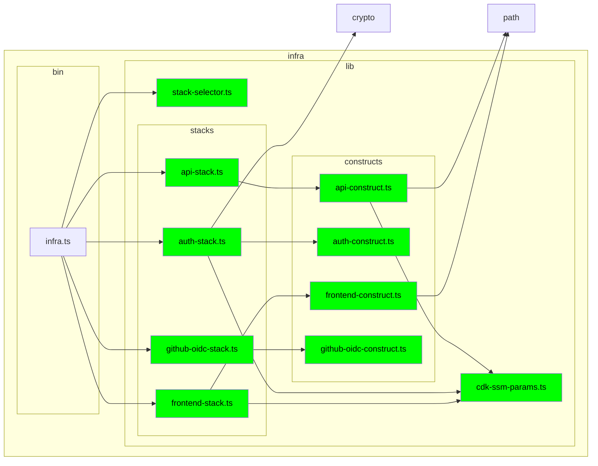

# Dependency graph — what imports what

Static import graph across all four apps, cruised in one pass. Companion to
`artifact-1-territory.md`, which it answers directly in two places.

## Method and its limits (read this first)

Run as `node scripts/depcruise.mjs`. Four things constrain every number below:

- **Imports only.** This artifact sees `import`/`require`/triple-slash edges and
  nothing else. Autoload, decorators, runtime messaging, filesystem reads and
  HTTP are all invisible. Where that matters it is called out by name — the
  blind spots are the finding, not a caveat.
- **Type-only edges are included** (`tsPreCompilationDeps: true`), so an
  `import type` across a boundary counts. This is stricter than the runtime
  graph, deliberately.
- **Ce counts npm and core, not just local**, and double-counts a package
  imported as both value and type (`frontend/src/api/client.ts` reports Ce=6 for
  5 distinct modules — `axios` twice). Read Ce as "surface to stand up".
- **Coverage:** `infra/scripts/` and `scripts/` were outside the cruise list when
  the tables below were computed; both were added on 2026-08-18 (191 modules,
  406 dependencies, still clean). They are build glue with no couplings of their
  own, so no number here changed — but note two of the four filesystem-level
  cross-app couplings live in `infra/scripts/`, and remain invisible to imports.

## The four apps: zero edges — unknown, not uncoupled

**Answers artifact-1's open question for artifact 2.** There is no import edge
between `frontend/`, `backend/`, `extension/` and `infra/` — none of the 12
ordered pairs, in either direction, including test trees and type-only imports,
out of 166 local edges.

Artifact 1 predicted this and framed it correctly: **the tool's silence means
`unknown`, not `uncoupled`.** Four real cross-app couplings exist and are
invisible to this graph:

| Coupling | Where it lives | When it binds |
| --- | --- | --- |
| `backend/test` reads the infra route registry | `backend/test/route-reachability.test.ts:16` | test time |
| infra packages the backend build | `infra/scripts/package-backend.mjs:17-31` | build time |
| infra deploys the frontend build | `infra/lib/constructs/frontend-construct.ts:43` | deploy time |
| infra writes the frontend's env | `infra/scripts/write-frontend-env.mjs:47` | build time |

Plus the two artifact 1 carries by hand: the duplicated response contracts
(`frontend/src/api/collections.ts` and `extension/src/types.ts`) and runtime HTTP
from both clients to the backend.

A `no-cross-app-imports` rule now enforces the zero, so the boundary fails loudly
if anyone reaches across with an import. Nothing guards the other six.

## Layer boundaries

**Frontend — holds, and is the only layering imports actually enforce.**
`pages -> api` is 8 edges, one-way. All three reverse directions are 0
(`api -> pages`, `auth -> pages`, `auth -> api`). One correction to the assumed
shape: **pages never depend on auth** (0 edges) — auth is reached only through
`App.tsx`. The real chain is `pages -> api -> auth`, three deep, `auth` a leaf.

**Backend — vacuous pass.** `plugins -> routes` is 0, as intended. But
`routes -> plugins` is *also* 0: routes do not import plugins at all. The real
dependency is 22 decorator calls (`sql` x18, `correlationId` x2, `jwtVerifier`,
`anthropicClient`) resolved through Fastify's registry at runtime. Nothing
violates the boundary because there is no import traffic to constrain.
`backend/src/fastify.d.ts` (Ce=4, Ca=4) is the only written record of that
contract.

**Two folder-level 2-cycles, both benign.** `plugins -> fastify.d.ts` (3) with
`fastify.d.ts -> plugins/config.ts` (1); and `App.tsx -> pages` (3) with
`pages -> src-root` (4, via `languages.ts` and `useSpeech.ts`). Neither is a
module-level cycle. Both come from a root folder holding entry points and shared
leaves at once.

## Cycles

**Zero, repo-wide.** 185 modules, 389 dependencies, 0 `no-circular` violations —
including type-only cycles, which is the stricter check. For a 5-week greenfield
this is the expected outcome; treat it as a baseline to protect, not a result.

## infra/lib — the one graph worth drawing

This graph answers a single question: **is `infra/lib`'s fan-out concentrated in
`api-construct.ts`, or spread across the four constructs?** Read as local
imports the answer is no — `api-construct.ts` has exactly one local edge
(`cdk-ssm-params.ts`), the same shape as its siblings, and the layering is a
clean `bin -> stacks -> constructs` in which no construct ever talks to another.
The concentration is real but lives in the AWS service surface this graph
deliberately excludes: 10 of that file's 12 dependencies are `aws-cdk-lib/*`
packages.

> Source: `context/map/infra-graph.mmd`, generated with
> `node scripts/depcruise.mjs --focus "^infra/lib" --exclude "node_modules" --output-type mermaid`

**What the structure shows**

- **Strict three layers, acyclic.** `bin/infra.ts` (Ce=6) fans out to the four
  stacks plus `stack-selector.ts`; each stack reaches its construct; constructs
  reach only `cdk-ssm-params.ts`. Nothing points back up.
- **One construct per stack, none reused.** `api-stack -> api-construct`,
  `auth-stack -> auth-construct`, `frontend-stack -> frontend-construct`,
  `github-oidc-stack -> github-oidc-construct`. The constructs are 1:1 wrappers,
  not shared building blocks.
- **Zero construct-to-construct edges.** `cdk-ssm-params.ts` (Ca=3) is the only
  shared local module, and it is consumed at two different layers — by two
  stacks and by one construct.

**Where the fan-out actually concentrates**

| Module | Ce | local | npm | core | distinct AWS services |
| --- | ---: | ---: | ---: | ---: | ---: |
| `constructs/api-construct.ts` | **12** | 1 | 10 | 1 | **8** |
| `constructs/frontend-construct.ts` | 7 | 0 | 6 | 1 | 4 |
| `constructs/auth-construct.ts` | 3 | 0 | 3 | 0 | 1 |
| `constructs/github-oidc-construct.ts` | 3 | 0 | 3 | 0 | 1 |

`api-construct.ts` pulls **8 of the 12 distinct AWS service modules** used by all
of `infra/lib` — apigatewayv2, apigatewayv2-authorizers,
apigatewayv2-integrations, cognito, iam, lambda, logs, ssm. So the fan-out *is*
concentrated in that one construct, but as **breadth of AWS configuration, not
module coupling**. That distinction changes the remedy: splitting the file into
smaller modules would move the risk, not reduce it.

**And the coupling that matters is not drawn at all.** `api-construct.ts` is a
hand-maintained registry of 8 explicit route paths mirroring
`backend/src/routes/` — no `{proxy+}` catch-all. `lessons.md:26-30` records it
shipping unreachable twice. No edge on this graph represents that.

## Testability — Ce as isolation cost

Ce and Ca are close to inversely distributed: nothing here is both hard to
isolate and widely depended on.

| | Low Ce (cheap to isolate) | High Ce (expensive to isolate) |
| --- | --- | --- |
| **High Ca** | `api/collections.ts` 1/10, `languages.ts` 0/6, `types.ts` 0/5, `connectionIssue.ts` 0/4 | *(empty)* |
| **Low Ca** | route helpers, print leaves | `api-construct.ts` 12/1, `App.tsx` 9/2, `collections/index.ts` 8/0, `client.ts` 6/2 |

The empty cell is the finding: every high-Ce module is a composition root, which
should be stood up rather than mocked, and every high-Ca module is a Ce<=1 leaf
needing no mocking at all. **Heavy mocking buys little in this codebase.**

| Area | Verdict | Evidence |
| --- | --- | --- |
| `frontend/src/pages` | Integration; stub the `api` seam only | Components Ce=5-7; `CollectionDetailPage.test.tsx` is Ce=8 — the test drags in more than its subject |
| `frontend/src/pages` print leaves | Unit (done) | `printRows` 1/2, `printLabels` 1/2, `printPagination` 0/2 |
| print pipeline | E2E / browser (done) | Geometry only exists in a browser |
| `frontend/src/api` | Integration, stub the network | `client.ts` Ce=6 spans token refresh + reporting + connection state |
| `frontend/src/api/collections.ts` | **Unit/contract — pay first** | Ce=1, **Ca=10**: cheapest test, widest reach, duplicated contract with no guard |
| `frontend/src/auth` | Integration with fake OIDC | `test/helpers/oidc.ts` (2/4) already the seam; `connectionIssue.ts` 0/4 is free to unit test |
| `backend/src/routes` | Integration only, never mock | `collections/index.ts` Ce=8 plus 18 `sql` calls; `test/helper.ts` Ca=10 builds a real app |
| `backend/src/plugins` | Integration into a bare Fastify | Ca understates by 22 decorator calls |
| `infra/lib/constructs` | **Synth assertions — currently zero** | See below |
| `extension/src/popup` | Integration with a fake `browser` API | `App.tsx` Ce=5; the background dependency is messaging, invisible to Ce |

**`infra/test/infra.test.ts` is Ce=0, Ca=0 because it is the unmodified CDK
scaffold stub** — every import commented out, `test('SQS Queue Created', () => {})`
with an empty body. `cd infra && npm test` runs jest against it and passes green
while testing nothing. Infra has no real coverage, and `checks.mjs:168` excludes
it from pre-push as well. The app holding the repo's highest-churn file is
guarded only from the backend's side, by `route-reachability.test.ts`.

## Open questions for artifact 3 / repo-map

- **Highest-value gap:** the `frontend` and `extension` contract duplication has
  no guard of any kind. The `backend`/`infra` twin does
  (`route-reachability.test.ts`, a static text diff with documented blind spots
  around non-literal route shapes).
- **`lessons.md:29` is stale** — it asserts "No test can catch it" about the
  infra route coupling; `route-reachability.test.ts` now does, statically.
- **Three `languages.ts` copies** (frontend/extension/backend) agree today on 8
  codes in three different data shapes, with nothing asserting parity.
- **Should `infra/scripts/` and `scripts/` join the cruise?** They are clean, and
  they hold two of the four invisible cross-app couplings.
