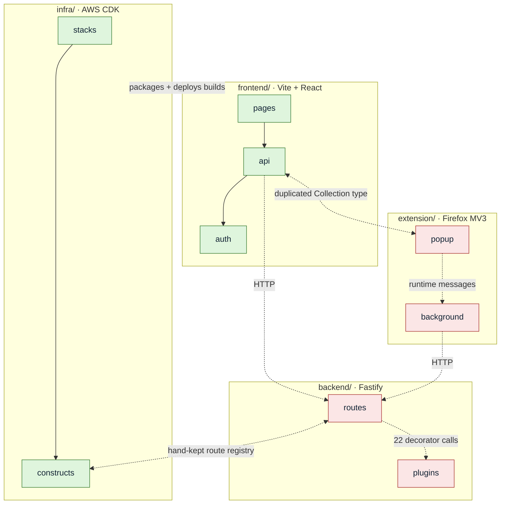

# InkLingo — repo map

Fifteen-minute orientation. Detail lives in the three source artifacts; this
document combines them and does not repeat their tables.

**Evidence convention.** Every coupling below is tagged with how it is known:

- **[import]** — visible in the dependency graph (`node scripts/depcruise.mjs`)
- **[git]** — inferred from co-change history
- **[unknown]** — no tool covers it. Recorded by hand, from prose or a comment.
  Never read this as "no coupling"; it means nothing can check it for you.

## TL;DR

Four independent npm projects, no root `package.json`, no workspace linking.
Install and run each separately. They share no code — **and that is the risk**,
because what they do share is duplicated by hand.

Solid arrows are import edges a tool can verify. **Every dashed arrow is
`[unknown]`** — no import edge exists, so no rule, metric or check sees it.
Green nodes are import-verified; red nodes participate only in couplings
nothing can check.

## Terrain — where work concentrates

The largest area of activity is the repo's own planning documentation, not any
application: `context/{changes,archive,foundation}` account for more file
touches than all four apps' `src/` combined, and tracked markdown is near 1:1
with tracked code. Treat `context/` as a first-class part of the codebase.

Within application code the concentration is `frontend/src/pages` and
`backend/src/routes` (roughly tied), then `infra/lib/constructs`, then
`frontend/src/api`, `backend/src/plugins`, `extension/src/popup`. Three clean
phases in the history: infrastructure first, then feature build-out, then test
hardening — the last stretch is dominated by tests and by archiving completed
changes. `infra/lib/constructs/api-construct.ts` is the highest-churn
application file. See artifact 1 for the counts.

## Real couplings

| Coupling | Evidence | How it binds |
| --- | --- | --- |
| `pages -> api -> auth` (frontend) | **[import]** | 8 one-way edges; all three reverse directions are 0. The only layering imports enforce |
| `stacks -> constructs` (infra) | **[import]** | 1:1 per stack, acyclic, no construct-to-construct edges |
| `routes -> plugins` (backend) | **[unknown]** | 0 import edges, 22 decorator calls through Fastify's registry. `backend/src/fastify.d.ts` is the only written record |
| `popup -> background` (extension) | **[unknown]** | Runtime `browser.runtime.sendMessage`. Absence of an edge is the architecture working |
| `frontend` ↔ `extension` response types | **[unknown]** + **[git]** (2 shared commits in 32) | `interface Collection` is byte-identical in `frontend/src/api/collections.ts:3` and `extension/src/types.ts:6`. **Nothing guards it** |
| `backend/src/routes` ↔ `infra/.../api-construct.ts` | **[unknown]** + **[git]** (3 shared commits) | Hand-kept registry of 8 explicit route paths, no `{proxy+}`. Partial static guard exists |
| `infra` -> `frontend`/`backend` builds | **[unknown]** | Filesystem at build/deploy time: packages `backend/dist`, deploys `frontend/dist`, writes `frontend/.env.production` |
| clients -> `backend` | **[unknown]** | Plain HTTP at runtime |

**There is no import edge between the four apps in either direction.** That is
the tool reporting silence, not independence — six of the eight rows above are
things it cannot see.

## Risk zones

Ordered by expected cost.

1. **The duplicated response contract — no guard of any kind.** Two clients
   declare the same backend shapes by hand; they agree today by attention. A
   backend field rename compiles everywhere and fails at runtime in whichever
   client was forgotten. `frontend/src/api/collections.ts` is also the repo's
   widest hub (10 dependents) **[import]**.
2. **Route registration.** A route added under `backend/src/routes/api/` is
   autoloaded, passes the entire backend suite, and 404s in production until a
   matching entry exists in `api-construct.ts`. This shipped broken twice.
   `backend/test/route-reachability.test.ts` now catches it by static text
   comparison — blind to non-literal route shapes.
3. **`infra/` has no real test coverage.** Its only test file is the unmodified
   CDK scaffold stub: imports commented out, empty body. `npm test` passes green
   while testing nothing, and pre-push skips infra too. This is the app holding
   the highest-churn file.
4. **`api-construct.ts` breadth.** Highest fan-out in the repo, but it is AWS
   configuration surface, not module coupling — splitting the file would move
   the risk, not reduce it.
5. **Silent boundaries.** The backend's routes/plugins split and the extension's
   popup/background split are conventions no static check can enforce. Both look
   green whether or not they are respected.

Reassuring counterweight: **zero circular dependencies repo-wide**, including
type-only cycles, and the frontend's layering is genuinely enforced.

## Where knowledge is written down

Single-author repo — there is no second person to ask, so every fact is in a
file or nowhere. Point at files, not people.

- **`AGENTS.md`** — the only true entry point: hard rules, per-app commands,
  quality gates, PR conventions.
- **`context/foundation/lessons.md`** — 9 entries, best value per line in the
  repo. Each is a bug class that already cost time.
- **`context/foundation/`** — `tech-stack.md` (required reading before
  questioning any stack choice), `prd.md`, `roadmap.md`, `test-plan.md`.
- **`context/archive/`** — 12 completed changes, each with `change.md`,
  `plan.md` and usually an implementation review. This is where "why was it
  built this way" is answered. Read-only by convention.
- **Code comments** — 15–30% of source lines, explanatory rather than
  descriptive. Highest in `infra/lib` (30%), which is also the least-tested app.

**One gap to know about:** `CLAUDE.md` is gitignored and therefore *not in your
clone*, though AGENTS.md points at it — ask the maintainer for a copy. AGENTS.md
plus `context/foundation/` carry everything strictly required without it. (Two
further staleness gaps found by artifact 3 — AGENTS.md's frontend paragraph and
`lessons.md`'s route entry — were fixed on 2026-08-18.)

## First files to read

1. **`AGENTS.md`** — rules, commands, gates.
2. **`CLAUDE.md`** — *request it; not in the clone.* Workflow and `context/`
   semantics.
3. **`context/foundation/tech-stack.md`** — 29 lines, and Hard Rules require it
   before you propose a different framework or datastore.
4. **`context/foundation/lessons.md`** — 9 traps, ~5 minutes.
5. **`frontend/src/api/collections.ts` + `extension/src/types.ts`** — read side
   by side. The duplication is the repo's central design tension in two files.
6. **`infra/lib/constructs/api-construct.ts`** — the route registry, and the
   file most likely to break a deploy.
7. **`context/archive/2026-08-06-testing-auth-resilience/`** — one change
   end-to-end (`change.md` -> `plan.md` -> `reviews/` -> `manual-verification.md`)
   shows the whole workflow.

Then: `git config core.hooksPath .githooks`, and `npm install` separately in
each of the four apps.

## Limitations

- **The history is 5 weeks and 4 days — 162 commits, one author** — not the
  12-month, multi-contributor window the mapping method assumes. Trends are
  weekly, not seasonal. (History has since grown by the dependency-cruiser
  tooling commit.)
- **Hotspots mean "recently built", not "eroded".** A file with 10 touches was
  authored over 10 commits; this is greenfield, not legacy.
- **The contributor map degenerates.** One author, so "who to ask" has a single
  answer for every area. Artifact 3 records this rather than manufacturing a map.
- **The dependency graph sees imports only.** Autoload, decorators, runtime
  messaging, filesystem reads and HTTP produce no edges. Everything tagged
  **[unknown]** above is invisible to every check in this repo.
- **`context/changes` dominates the activity ranking**, which may mask
  code-only hotspots. A re-run excluding `context/` would give a cleaner view.
